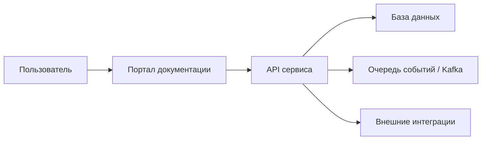

# C4: Контекст системы

## Ключевые взаимодействия

- Разработчик использует API для интеграций.
- GitHub Actions публикует документацию на GitHub Pages.
- Портал документации выступает источником контрактов и примеров.
