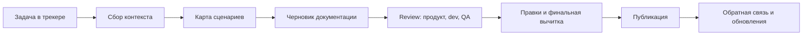

# Documentation Workflow

Эта страница показывает, как я вижу рабочий процесс документации в продуктовой команде: от задачи в трекере до публикации и обратной связи.

## Цель процесса

Сделать документацию частью разработки, а не отдельной активностью после релиза.

Хороший workflow помогает:

- фиксировать договоренности письменно;
- снижать количество повторных уточнений;
- связывать документацию с задачами и релизами;
- проверять контент до публикации;
- поддерживать базу знаний в актуальном состоянии.

## Роли

| Роль | Что дает в процесс |
|---|---|
| Product / Analyst | Контекст задачи, бизнес-правила, ограничения |
| Designer | Макеты, состояния интерфейса, UX-логика |
| Developer | Технические ограничения, API, edge cases |
| QA | Проверочные сценарии и регрессионные риски |
| Технический писатель / DocOps | Структура, текст, workflow, публикация |

## Поток работы

## Definition of Ready

Документационная задача готова к работе, если есть:

- ссылка на продуктовую задачу;
- описание пользовательского сценария;
- макеты или текстовое описание интерфейсных состояний;
- список затронутых ролей пользователя;
- известные ограничения и edge cases;
- источник истины: API-контракт, задача, макет или решение команды.

## Definition of Done

Документация готова к публикации, если:

- структура соответствует типу материала: guide, reference, explanation или changelog;
- термины согласованы с интерфейсом и API;
- примеры проверены;
- ошибки и альтернативные сценарии описаны;
- ссылки работают;
- есть владелец страницы и понятный способ обновления.

## Где здесь моя роль

Моя сильная зона — превращать разрозненные вводные в понятный процесс:

- вытаскивать неописанные сценарии;
- фиксировать письменные уточнения в задачах;
- связывать требования, макеты и технические ограничения;
- готовить документацию так, чтобы ее можно было поддерживать после релиза.
