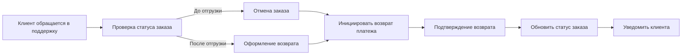
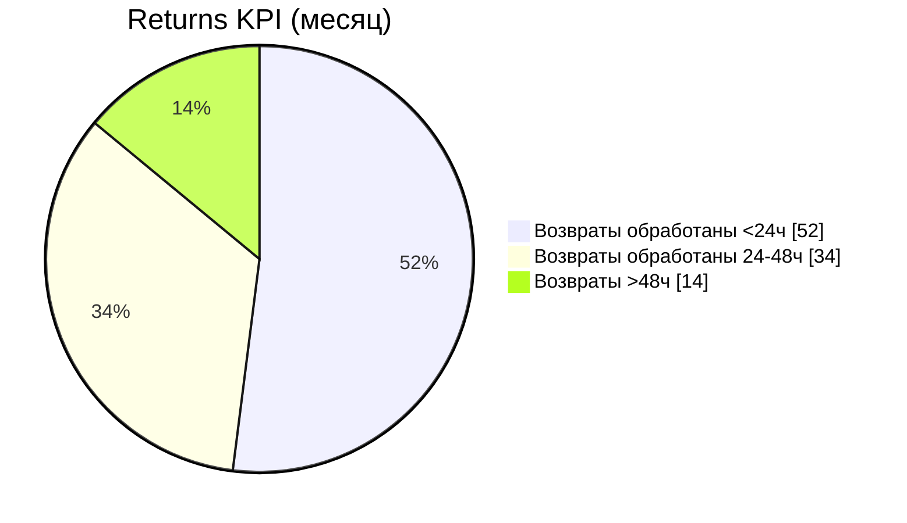

# Сценарий: Возврат / отмена

## Контекст

Клиент запрашивает отмену или возврат. Система должна корректно проверить статус заказа, зафиксировать решение и инициировать возврат средств.

## BPMN (бизнес)

## API (технический контракт)

| Операция | Метод и путь | Назначение | Успех | Ошибки |
|---|---|---|---|---|
| Получить заказ | `GET /store/order/{orderId}` | Проверить состояние | `200` | `404` |
| Обновить заказ | `PUT /store/order` | Выставить `cancelled`/`returned` | `200` | `400`, `409` |
| Удалить заказ | `DELETE /store/order/{orderId}` | Техническая очистка (по политике) | `200` | `404` |

## Dev-задачи (что меняем в системе)

- Ввести явные статусы `cancelled`, `return_requested`, `returned`.
- Запретить отмену после статуса `delivery_in_progress` без флага супервизора.
- Добавить audit trail для всех изменений статуса заказа.
- Добавить webhook событие `order.refund.completed`.

## User guide (действия оператора)

1. Найти заказ по `orderId`.
2. Проверить, на каком этапе находится доставка.
3. Если возможно, выполнить отмену; иначе оформить возврат.
4. Проверить факт возврата средств.
5. Зафиксировать комментарий причины обращения.

!!! note "Рекомендация"
    Используйте единый справочник причин отмены для последующей аналитики.

## Дашборд (как измеряем эффект)

- Cancellation rate по категориям питомцев.
- Return processing time (в часах).
- Refund success rate.

## Связанные разделы

- [Пользовательские инструкции](/portfolio/users/onboarding/)
